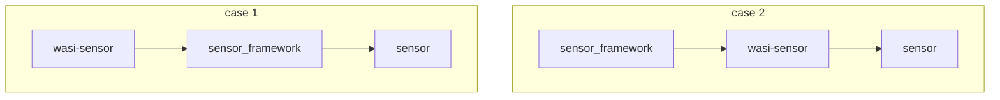

# WASI-Sensor Idea Discussion

A proposed [WebAssembly System Interface](https://github.com/WebAssembly/WASI) API from Midokura.

Caution: This is a draft proposal and is subject to change.


## Table of Contents

- [WASI-Sensor Idea Discussion](#wasi-sensor-idea-discussion)
  - [Table of Contents](#table-of-contents)
  - [Introduction](#introduction)
  - [Goals](#goals)
  - [Non-goals, Out-of-scope](#non-goals-out-of-scope)
  - [API walk-through](#api-walk-through)
    - [Sensor lifecycle management](#sensor-lifecycle-management)
    - [Sensor data quality control](#sensor-data-quality-control)
    - [Sensor](#sensor)
      - [\[Use case 1: GPS/GNSS, IMU (1-3D data) sensor control\]](#use-case-1-gpsgnss-imu-1-3d-data-sensor-control)
    - [Candidate sensor framework (under wasi-sensor): RTKLIB](#candidate-sensor-framework-under-wasi-sensor-rtklib)
      - [\[Use case 2: Image/Depth sensor (2/3D data) control\]](#use-case-2-imagedepth-sensor-23d-data-control)
    - [Candidate sensor(camera) framework: v4l2, libcamera, GeniCam](#candidate-sensorcamera-framework-v4l2-libcamera-genicam)
    - [Buffer-pool](#buffer-pool)
      - [\[Use case 1: Buffer overwrite mode\]](#use-case-1-buffer-overwrite-mode)
      - [\[Use case 2: Sensor virtualization\]](#use-case-2-sensor-virtualization)
  - [Detailed design discussion](#detailed-design-discussion)
    - [\[Relationship between wasi-i2c, wasi-spi #1\]](#relationship-between-wasi-i2c-wasi-spi-1)
    - [\[Relationship between wasi-io #2\]](#relationship-between-wasi-io-2)
  - [Stakeholder Interest and Feedback](#stakeholder-interest-and-feedback)
  - [References and acknowledgements](#references-and-acknowledgements)

## Introduction

This interface helps reduce the effort required on the host side (platform vendor) to deal with a series of fragmented sensor frameworks. 

In regard to the interface required for subscribing to sensor data, this document also provides a buffer-pool interface as a complementary interface. 
In the future this could be merged into other specifications, such as **wasi-messaging** or **wasi-io**, but for now, it will serve to enable unified control over systems with different scales of devices and OSs.

## Goals 

The primary goal is to provide a platform-agnostic, unified sensor control interface to be used either above or below typical sensor/camera frameworks.
  
This covers:

  - Sensor lifecycle management.
  - Sensor data quality control.
  - Sensor data type definition.



> When the **wasi-sensor** is positioned above the **sensor_framework**, sensor data should be kept in host memory and processed by **sensor_framework** or other native processing.

> When the **wasi-sensor** is positioned below the **sensor_framework**, sensor data should be copied to linear memory and processed by **sensor_framework** or **webassembly module**.

The secondary goal is to provide the buffer-pool management interface for connecting various application use cases and various embedded or IoT environments.
  
This covers:

  - Buffer overwrite mode.
  - Sensor virtualization.
  
## Non-goals, Out-of-scope

- Support Media framework, such as live video/audio streaming.
- Support Signal/Data processing, such as filtering or converting the format.  

## API walk-through

The full API documentation can be found [here](sensing.md).

### Sensor lifecycle management

- This interface provides access to sensor controllers owned by vendors and other sensor frameworks. 
Here, sensor (device) is treated as the resource, which the **webassembly module** can access via a handle. Exclusive access to the device would be set by defining ownership to the handle.

The concept here is similar to [Sensor object](https://www.w3.org/TR/generic-sensor/#sensor)

```rust

interface sensor {
  use property.{property-key, property-value};

  // Sensor device
  resource device {
      /// open the device.
      /// this might power on the device.
      open: static func(name: string) -> result<device, device-error>;

      /// get a list of names of devices available on the system.
      list-names: static func() -> result<list<string>, device-error>;

      /// start sending the data to buffer
      start: func(
          buffer-pool: string
      )->result<_, device-error>;

      /// stop sending the data to buffer
      stop: func(
      )->result<_, device-error>;

      /// set property
      set-property: func(
          key: property-key,
          value: property-value
      ) ->result<_, device-error>;

      /// get property
      get-property: func(
          property: property-key
      )->result<property-value, device-error>;
  }
}
```

### Sensor data quality control

The settings for improving the data quality depends on the device, but by using generalized interface named as property it is possible to control this using the above sensor interface.

This is the example of the kind of setting that is prepared: 

```rust
    record dimension {
        /// Image width.
        width: u32,
        /// Image height.
        height: u32,
        /// Image stride
        stride-bytes: u32,
        /// The format of a pixel.
        pixel-format: pixel-format,
    }
```

```rust
  variant property {

    dimension(dimension),
    sampling-rate(sampling-rate),

    ...
  } 
```

### Sensor

#### [Use case 1: GPS/GNSS, IMU (1-3D data) sensor control]

> Once the sensor is activated via **wasi-sensor**, raw data is published from **GPS**/**GNSS**/**IMU** sensor with each vendor's original format and converted to a generic position and posture data through some software components provided by each vendor. 
**Wasi-sensor** supports passing this general data format in unified way.
Later on, these information would be processed to be used for localization, mapping, posture control, and so on, but for now it is out of scope for the **wasi-sensor**.

### Candidate sensor framework (under wasi-sensor): RTKLIB

#### [Use case 2: Image/Depth sensor (2/3D data) control]

> Once the sensor is activated, raw data is published from the Image/Depth sensor with each vendor's original format such as Bayer + alpha, and converted to a general data format, such as RGB24, through some software components provided by each vendor. 
**Wasi-sensor** supports passing this general data format in a unified way.

```rust
    variant frame-data {
        /// data passed by value
        by-value(data-type),

        /// a reference to host memory
        host-memory(memory),
    }
```

These data generally have the dimensions of width and height and are handled with these information. 
Later on, these information would be processed to be used for object recognision, video streaming, and so on, but for now it is out of the scope for the **wasi-sensor**.  

### Candidate sensor(camera) framework: v4l2, libcamera, GeniCam

```rust
    record image {
        dimension: dimension,
        payload: list<u8>,
    }
```

```rust
  record dimension {
      /// Image width.
      width: u32,     
      /// Image height.    
      height: u32,   
      /// Image stride 
      stride-bytes: u32,
      /// The format of a pixel.  
      pixel-format: u8,
  }
```

### Buffer-pool

#### [Use case 1: Buffer overwrite mode]

Realtime usecase  --- Buffering off

> Real-time performance (low latency) is important for highly interactive applications that do not require time-series data, such as object recognition, which only requires a single image for processing. In that case, buffering must be disabled and the latest data must always be supplied to the application.

Sensing usecase --- Buffering on

> Reliable data (usually time-series) is critical for sensing applications such as object tracking and behavior analysis. Unlike in a realtime use case, it is not necessary to provide real-time data to the application. The reliability is the main priority. In that case, buffering must be enabled to store a certain amount of time-series data with no room for error. 

Hence, the below buffering-mode interface setting is presented for the application.

```rust
    enum buffering-mode {
        buffering-off,
        buffering-discard,     /**< Discard the latest frame. behave like queue */
        buffering-overwrite,   /**< Overwrite the oldest frame. behave like ring */
    }
```

#### [Use case 2: Sensor virtualization]

There are two motivations for virtualizing the **sensor**. 

  1. [Sensor Fusion](https://www.w3.org/TR/generic-sensor/#sensor-fusion) 

     Produce another sensing data by fusioning several sensor data (for example, SLAM sensor).
     
  2. [Platform-sensor](https://www.w3.org/TR/generic-sensor/#concept-platform-sensor)

     Use the same sensor data from multiple applications simultaneously.

For this purpose, **buffer-pool** can work as a virtualized sensor. For this purpose, the **buffer-pool* part of the wasi-sensor might be improved as Post MVP.

## Detailed design discussion

Relationship between **sensor interface** and **buffer-pool interface** [here](frame_management.md).

### [Relationship between [wasi-i2c](https://github.com/WebAssembly/wasi-i2c), wasi-spi #1]

wasi-i2c is effective for special settings that cannot be covered by Wasi-sensor, so they will coexist.

### [Relationship between [wasi-io](https://github.com/WebAssembly/wasi-io) #2]

First, we would like to confirm the effectiveness in an environment with few resources, and then consider whether we can incorporate important essences into wasi-io.

[etc.]


## Stakeholder Interest and Feedback

TODO before entering Phase 3.

[This should include a list of implementers who have expressed interest in implementing the proposal]

## References and acknowledgements

Many thanks for valuable feedback and advice:

- [@username] (https://www.github.com/username)
- [@username] (https://www.github.com/username)
- [etc.]
