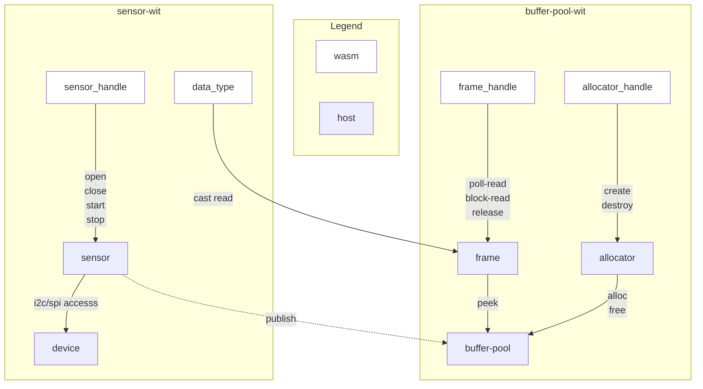
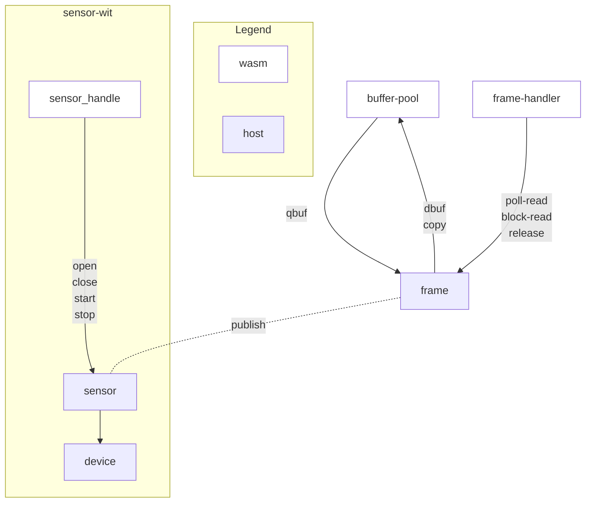

## Relationship between sensor interface and buffer-pool interface

Sensors are always data publishers and will continue to provide the data at regular intervals. 

We assume sensor data would be temporarily stored in the buffer on the host side. This is because:

- Sensor data frequency is relatively high or sensor data is relatively large in many cases to be used for sensing purpose
- Memory management in an environment with low resources should be performed on the host side

Therefore, buffer-pool interface is proposed as an independent interface to manage the buffer-pool on the host side.
However, since the contents of the buffer pool are sensor data, the contents can be cast to sensor data type on the wasm side when data is passed to the wasm side. 

When connecting to other interfaces, such as the [Generic Sensor API](https://www.w3.org/TR/generic-sensor/), the [Sampling frequencies](https://www.w3.org/TR/generic-sensor/#concepts-sampling-and-reporting-frequencies) is connected to the sensor and the reporting frequency is connected to the buffer-pool. 
 

## Considered alternatives

### No Data Type definition?

It may not be necessary to specify the data type of the sensor here, as WASI-NN does not specify a definition for the content of the inference results.
At a minimum, entensibility for this interface is needed.   

### No Buffer-pool definition?

It is also possible to put buffer on the linear memory side. In that case, if the host memory and linear memory are not shared, copying will occur, but this method must be adopted if multiple processes handle the same data.

### Frame 

Frame has the below data structure. In order to be passed to other processing at host environment or Webassembly environment, handle or data itself should be stored together with the timestamp and other identifier information.  

    record frame-info {
        sequence-number: u64,
        rawdata: list<raw-data>   
    }

    record raw-data {
        /// when data is used from wasm (copied to linear memory)
        wasm: option<data-type>, 
        /// when data is kept at host and passed to other native processing
        host: option<memory>,     
        timestamp: u64
    }
